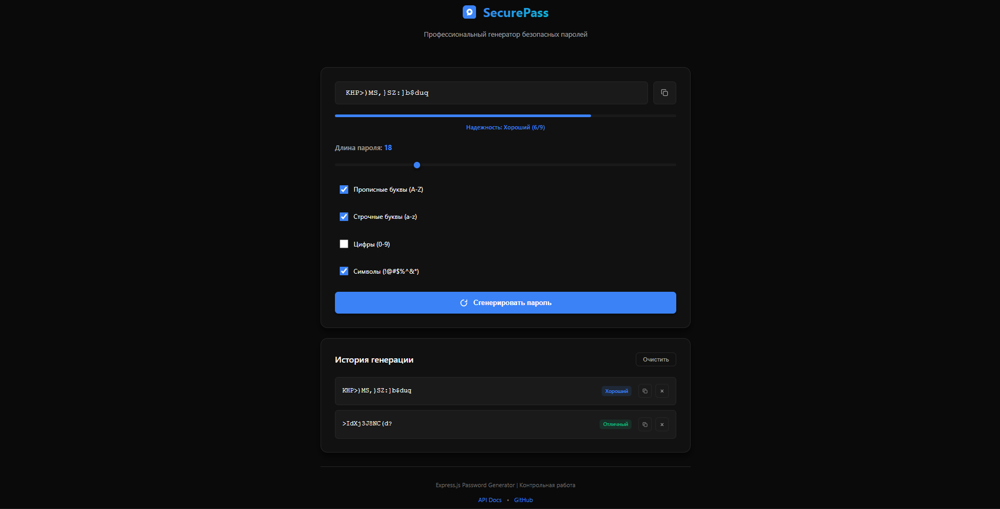
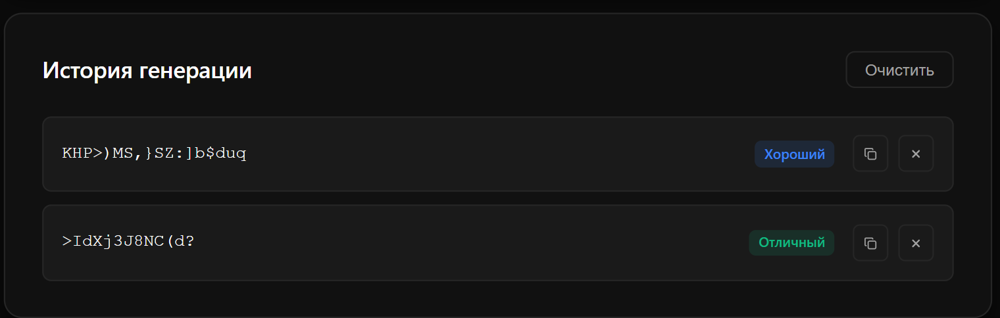
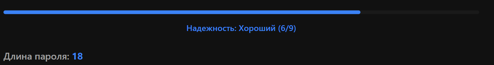

# 🔐 SecurePass - Генератор Паролей

Профессиональное Express.js приложение для генерации безопасных паролей с REST API и современным веб-интерфейсом.

## 📋 Описание проекта

Это полноценное Express-приложение, разработанное в рамках контрольной работы по Express.js. Приложение демонстрирует:

- ✅ Базовый Express-сервер с маршрутизацией
- ✅ RESTful API (GET, POST, DELETE)
- ✅ Работу с параметрами (req.params, req.query, req.body)
- ✅ Обработку JSON и URL-encoded данных
- ✅ Собственные middleware (логирование, валидация, обработка ошибок)
- ✅ Раздачу статических файлов
- ✅ Модульную архитектуру (routes + controllers + middleware)

## 🚀 Функциональность

### Основные возможности:

- **Генерация паролей** с настраиваемыми параметрами:
  - Длина: 4-64 символа
  - Прописные буквы (A-Z)
  - Строчные буквы (a-z)
  - Цифры (0-9)
  - Специальные символы (!@#$%^&*)

- **Оценка надежности пароля**:
  - Автоматический расчет силы пароля
  - Визуальная индикация (Слабый/Средний/Хороший/Отличный)
  - Анализ используемых символов

- **История генерации**:
  - Сохранение последних 50 паролей
  - Копирование паролей из истории
  - Удаление отдельных записей
  - Полная очистка истории

- **Современный UI**:
  - Темная тема в стиле профессиональных инструментов
  - Адаптивный дизайн для всех устройств
  - Интерактивные элементы с анимациями
  - Toast-уведомления

## 📁 Структура проекта

```
password-generator-express/
├── server.js                 # Главный файл сервера
├── package.json             # Зависимости проекта
├── README.md                # Документация
│
├── routes/                  # Маршруты
│   ├── passwordRoutes.js    # Маршруты для генерации паролей
│   └── historyRoutes.js     # Маршруты для истории
│
├── controllers/             # Контроллеры
│   ├── passwordController.js # Логика генерации паролей
│   └── historyController.js  # Логика работы с историей
│
├── middleware/              # Middleware
│   ├── logger.js           # Логирование запросов
│   ├── validate.js         # Валидация параметров
│   └── errorHandler.js     # Обработка ошибок
│
└── public/                  # Статические файлы
    ├── index.html          # Главная страница
    ├── styles/
    │   └── main.css        # Стили приложения
    └── js/
        └── app.js          # Клиентская логика
```

## 🛠️ Установка и запуск

### Требования:
- Node.js версии 14 или выше
- npm или yarn

### Шаги установки:

1. **Клонировать репозиторий**
```bash
git clone <repository-url>
cd password-generator-express
```

2. **Установить зависимости**
```bash
npm install
```

3. **Запустить сервер**

Режим разработки (с автоперезагрузкой):
```bash
npm run dev
```

Продакшн режим:
```bash
npm start
```

4. **Открыть в браузере**
```
http://localhost:3000
```

## 📡 API Документация

### Генерация пароля

**GET** \`/api/password/generate\`

Query параметры:
- \`length\` (number, 4-64): длина пароля
- \`uppercase\` (boolean): использовать прописные буквы
- \`lowercase\` (boolean): использовать строчные буквы
- \`numbers\` (boolean): использовать цифры
- \`symbols\` (boolean): использовать символы

Пример запроса:
```
GET /api/password/generate?length=16&uppercase=true&lowercase=true&numbers=true&symbols=true
```

**POST** \`/api/password/generate\`

Body (JSON):
```json
{
  "length": 16,
  "uppercase": true,
  "lowercase": true,
  "numbers": true,
  "symbols": true
}
```

Ответ:
```json
{
  "success": true,
  "password": "aB3$xY9#mK2!pL5@",
  "length": 16,
  "strength": {
    "score": 8,
    "level": 4,
    "label": "Отличный",
    "color": "#10b981",
    "checks": {
      "hasLowercase": true,
      "hasUppercase": true,
      "hasNumbers": true,
      "hasSymbols": true,
      "length": 16
    }
  },
  "timestamp": "2024-01-15T10:30:00.000Z",
  "options": { ... }
}
```

### Проверка силы пароля

**GET** \`/api/password/strength/:password\`

**POST** \`/api/password/check\`

Body (JSON):
```json
{
  "password": "MyPassword123!"
}
```

### История генерации

**GET** \`/api/history\` - получить историю

Query параметры:
- \`limit\` (number): ограничить количество записей

**POST** \`/api/history\` - добавить в историю

**DELETE** \`/api/history/:id\` - удалить запись по ID

**DELETE** \`/api/history\` - очистить всю историю

## 🔒 Middleware

### 1. Logger Middleware
Логирует все входящие запросы с информацией:
- Метод и URL запроса
- IP адрес клиента
- Query и Body параметры
- Статус ответа и время обработки

### 2. Validate Middleware
Валидирует параметры генерации пароля:
- Проверка диапазона длины (4-64)
- Проверка типов данных
- Проверка наличия хотя бы одного типа символов

### 3. Error Handler Middleware
Централизованная обработка ошибок:
- Логирование ошибок в консоль
- Форматирование ответов с ошибками
- Детальная информация в режиме разработки

## 📱 Особенности UI

- **Адаптивный дизайн**: работает на всех устройствах
- **Темная тема**: профессиональная цветовая схема
- **Интерактивность**: плавные анимации и переходы
- **Визуализация**: индикатор силы пароля с цветовой кодировкой
- **Удобство**: копирование в один клик, история генерации

## 🧪 Тестирование API

Примеры запросов с использованием curl:

```bash
# Генерация пароля (GET)
curl "http://localhost:3000/api/password/generate?length=20&uppercase=true&lowercase=true&numbers=true&symbols=true"

# Генерация пароля (POST)
curl -X POST http://localhost:3000/api/password/generate \\
  -H "Content-Type: application/json" \\
  -d '{"length":20,"uppercase":true,"lowercase":true,"numbers":true,"symbols":true}'

# Проверка силы пароля
curl http://localhost:3000/api/password/strength/MyPassword123!

# Получить историю
curl http://localhost:3000/api/history?limit=5

# Очистить историю
curl -X DELETE http://localhost:3000/api/history
```

## 🎓 Соответствие требованиям контрольной работы

✅ **Базовый Express-сервер** - server.js  
✅ **Маршруты (GET, POST, DELETE)** - routes/  
✅ **req.params, req.query, req.body** - используются во всех контроллерах  
✅ **express.json() и express.urlencoded()** - настроены в server.js  
✅ **Собственные middleware** - logger, validate, errorHandler  
✅ **express.static()** - раздача файлов из public/  
✅ **Модульная архитектура** - routes + controllers + middleware  
✅ **GitHub с README** - полная документация и структура  

## 📸 Скриншоты

### Главная страница


### История генерации


### Индикатор силы пароля

# KR_5
# KR_5
